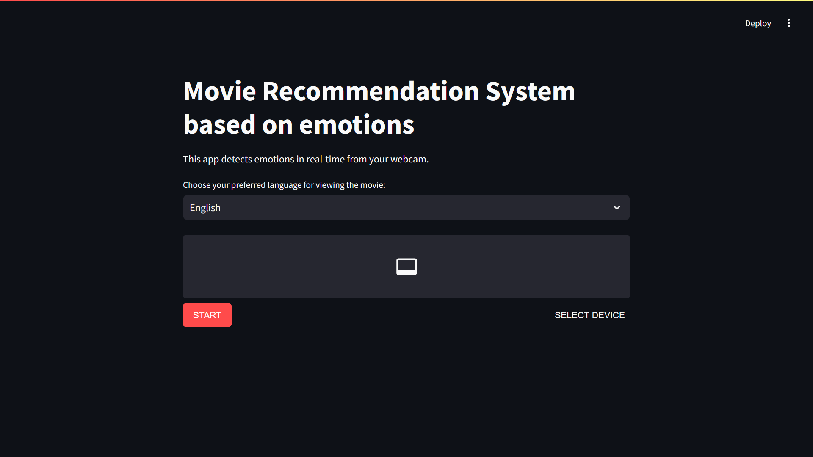

## Installation and Usage
Install all the required dependencies using :
```python3
pip install requirements.txt
```

Then clone the repository using :
```git
git clone https://github.com/team12ou/express-cinema
```

Then open terminal inside express-cinema folder/directory and run this command for running the application.
```python3
streamlit run app.py
```
## Screenshots

